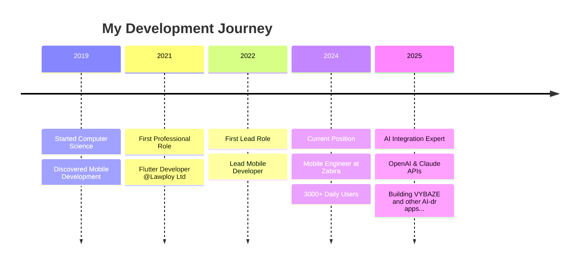

# Hey there! I'm Akintade Oluwaseun Timothy 👋

## 🚀 About Me

I'm a passionate **Mobile Developer** with 4+ years of Flutter and 2+ years of SwiftUI experience, currently based in **Manchester, UK**. I specialize in building scalable fintech and consumer applications that solve real-world problems.

- 🔭 Currently working as **Mobile Engineer** at Zabira Technologies
- 🌱 Exploring **AI integrations** with OpenAI and Claude APIs
- 👥 Led development teams serving **3,000+ daily active users**
- 📱 Maintained **99.5% crash-free rates** across production apps
- 💡 Passionate about creating solutions that make a real impact

## 🛠️ Tech Stack

### Mobile Development

### Backend & APIs

### AI & Integrations

### DevOps & Tools

## 🚀 Featured Projects

### 🎵 [VYBAZE](https://github.com/tade-dev/vybaze) - AI Music Feedback Platform
**Problem:** Independent artists lack professional feedback before release  
**Solution:** AI-powered platform providing industry-standard music critiques  
**Tech:** SwiftUI • Vapor • OpenAI API • Firebase

### 🍽️ [Foodnify](https://github.com/tade-dev/foodnify) - Smart Nutrition Assistant
**Problem:** Users struggle with meal planning and calorie tracking  
**Solution:** AI-powered meal planning with photo-based calorie estimation  
**Tech:** Flutter • Claude API • Firebase • GetX

### ⛽ [Fuel Alert](https://github.com/tade-dev/fuel-alert) - Real-time Price Tracker
**Problem:** Drivers waste money on expensive fuel due to lack of pricing data  
**Solution:** Crowd-sourced pricing network with smart alerts  
**Tech:** Flutter • Google Maps API • BLoC • Firebase

### 💰 [How Much App](https://github.com/tade-dev/how_much_app) - Freelancer Pricing Tool
**Problem:** Freelancers underprice services due to lack of market data  
**Solution:** AI-powered pricing calculator with market analysis  
**Tech:** Flutter • OpenAI API • Node.js • BLoC

## 🎯 Current Focus

- 🤖 **AI Integration**: Exploring advanced AI implementations in mobile apps
- 📱 **Cross-Platform Excellence**: Perfecting Flutter and SwiftUI architectures
- 🏗️ **Scalable Solutions**: Building apps that can handle massive user bases
- 👥 **Team Leadership**: Mentoring developers and driving project success

## 📈 Professional Journey

## 🤝 Let's Connect!

I'm always excited to collaborate on innovative projects and discuss mobile development, AI integrations, or startup ideas!

---

**"Building mobile solutions that make a real difference in people's lives"**

